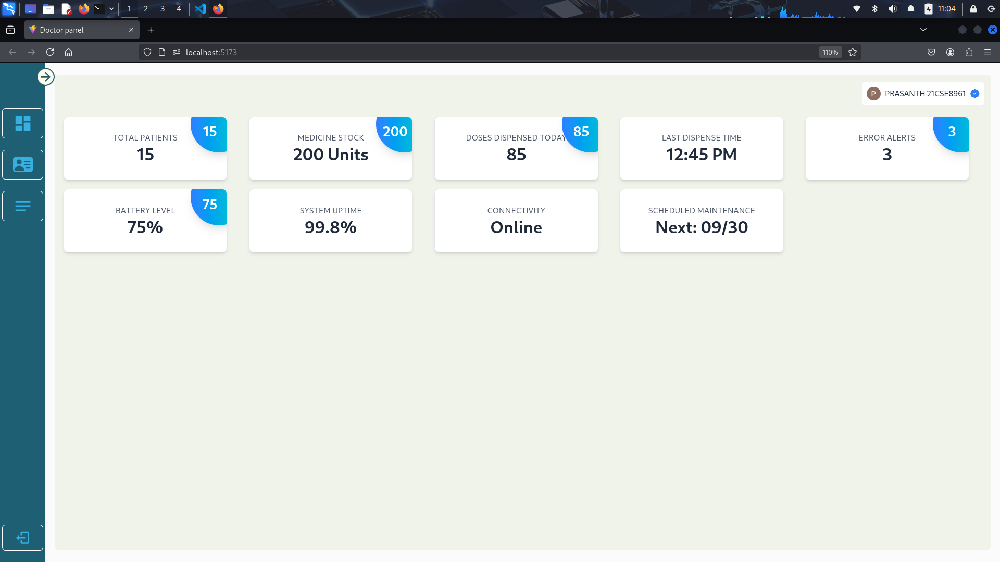
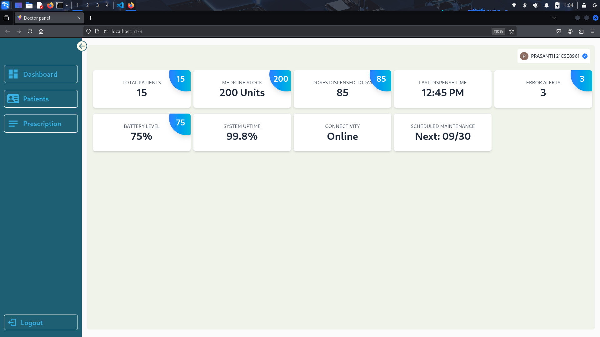
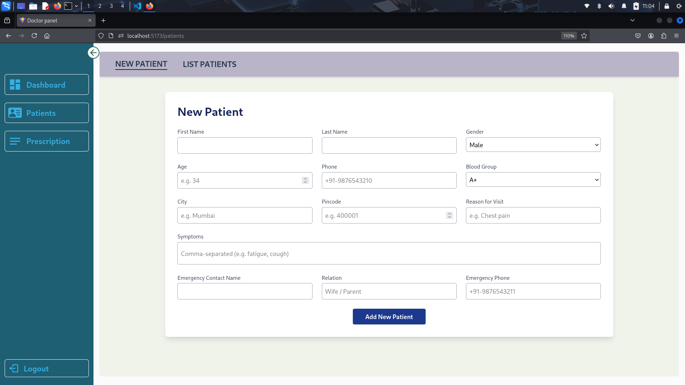
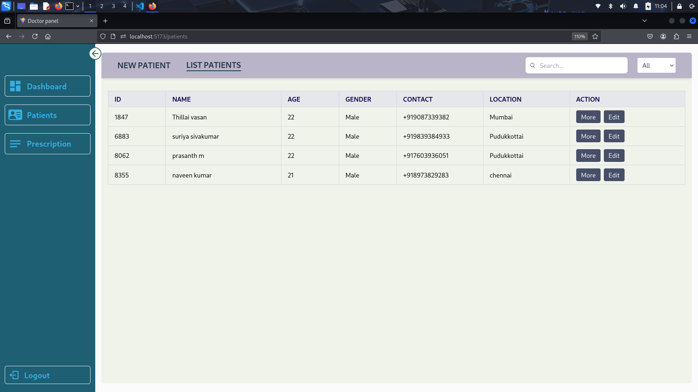
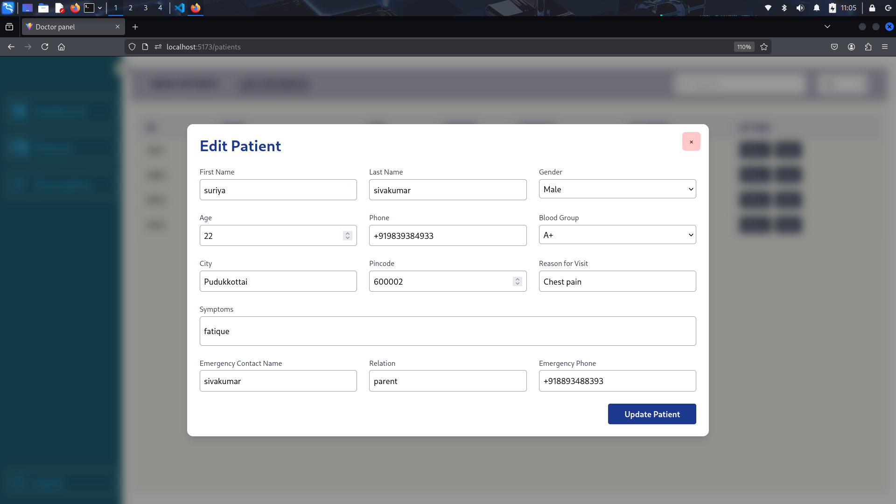
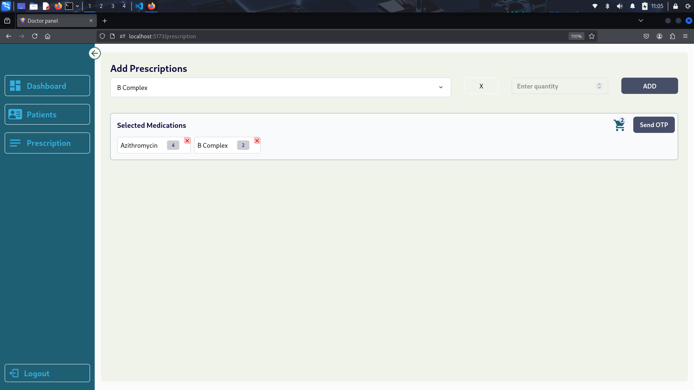
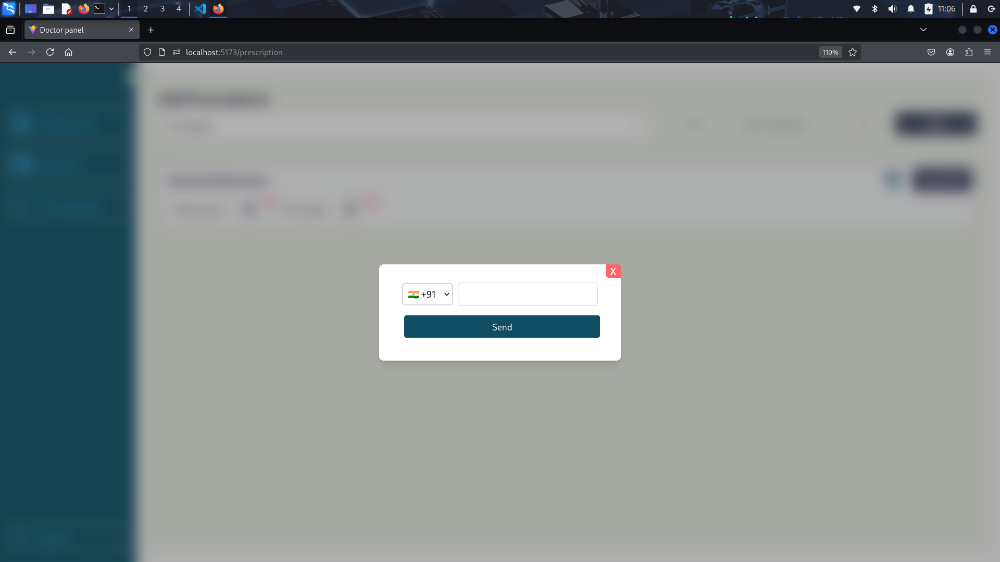

# 🩺 Doctor Panel Dashboard

A responsive Doctor Panel Dashboard built with **React** to monitor a dispenser machine, manage patient records, and prescribe medication via mobile or desktop.

This platform helps doctors to:
- Add and manage patients
- Check the live status of a dispenser machine
- Edit patient details
- Provide prescriptions directly from a mobile-friendly dashboard

---

## 📱 Features

- ✅ **Patient Management**  
  Add new patients with detailed info (personal, medical, visit, and emergency contacts).

- 🧾 **Prescription Management**  
  Easily generate prescriptions from previous visits or add new ones from scratch.

- 🟢 **Dispenser Status Monitoring**  
  View live operational status of the medicine dispensing machine.

- ✏️ **Edit Functionality**  
  Modify patient details on the go — full support for nested data editing.

- 🔍 **Search & Filter**  
  Quickly search patients by name, phone, blood group, etc.

- 💾 **Favorites & Saved Records**  
  Save frequent patients for quick access.

- 📱 **Mobile-Responsive UI**  
  Optimized experience for mobile and tablet usage.

---

## 🧰 Tech Stack

| Tech        | Usage               |
|-------------|---------------------|
| React       | Frontend Framework  |
| Tailwind CSS| Styling             |
| Firebase    | Realtime DB & Auth  |
| Vite        | Build tool          |
| React Icons | Icon library        |

---

## 📁 Folder Structure

```plaintext
doctor-panel/
├── public/
│   └── images/                  # Screenshot assets
├── src/
│   ├── Components/              # Reusable UI components (Sidebar, FormFields, etc.)
│   ├── Pages/                   # Main pages (Auth, Patients, Prescription)
│   ├── global/                  # Global styles (Tailwind config, base CSS)
│   ├── hooks/                   # Custom React hooks (e.g., usePrevious)
│   ├── utils/                   # Utility functions
│   ├── App.jsx
│   └── main.jsx
├── .env                         # Environment variables for Firebase
├── package.json                 # Project metadata and dependencies
├── vite.config.js               # Vite build config
└── README.md                    # Project documentation

```

---


## 📸 Output Screens

### 🧑‍⚕️ Dashboard Overview


### 🧑‍⚕️ Dashboard Overview Sidebar Extented 


### ➕ Add Patient


### ➕ List Patient


### ✏️ Edit Patient


### 💊 Prescription Panel


### 📋 Prescription send to phone


---

## 🚀 Getting Started

### Prerequisites

- Node.js (v18+)
- Firebase Project (setup Firestore DB and Auth)

### Installation

```bash

git clone https://github.com/prasanth8961/doctor-panel.git
cd doctor-panel
npm install

```

## Set Firebase Configuration

### Create a .env file in the root directory:

VITE_API_KEY=your_api_key
VITE_AUTH_DOMAIN=your_project.firebaseapp.com
VITE_PROJECT_ID=your_project_id
VITE_STORAGE_BUCKET=your_project.appspot.com
VITE_MESSAGING_SENDER_ID=your_messaging_id
VITE_APP_ID=your_app_id


## Run Locally

```bash

npm run dev

```

## ✍️ Contribution

### Feel free to fork this repo and submit pull requests. For major changes, please open an issue first.


---

## 📄 License

MIT License © 2025 prasanth